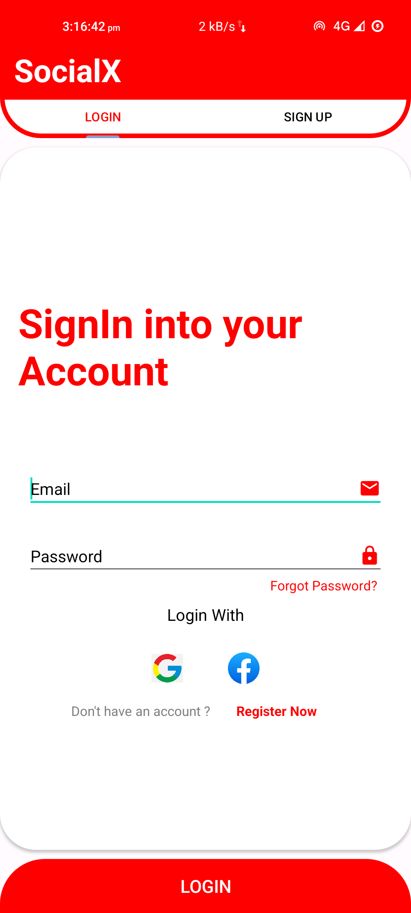

# SocialX
A News App with login and signUp fragments with one click login with google,
show news and search news functionality.

Libraries/ Frameworks used are :-
>Firebase for authentication,
>NewsApi as API for news, 
>Volly Library for API handling,
>Glibe for images.

,
,
,

https://user-images.githubusercontent.com/59947567/214812312-258cfa11-cc8d-4911-9d6d-4a2ff7e7d991.mp4
